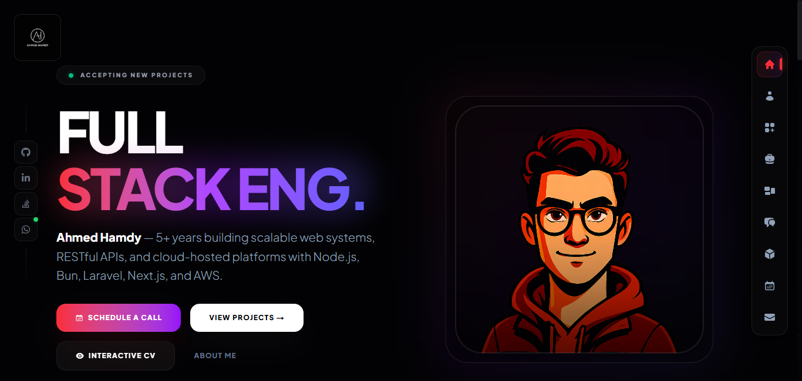

# Ahmed Hamdy Portfolio



[](https://nextjs.org/)
[](https://www.typescriptlang.org/)
[](https://bun.sh/)
[](./LICENSE)

The source code for a responsive developer portfolio and resume site built with Next.js, React, TypeScript, and Tailwind CSS. It presents projects as case studies, includes resume and experience views, and provides a contact and meeting-booking workflow.

## Features

- Responsive portfolio pages for projects, services, skills, work history, testimonials, and contact.
- Project case studies with galleries, architecture diagrams, technology details, and GitHub links.
- Resume modal with professional information and social profiles.
- Meeting scheduling form available at `/schedule`.
- Google Calendar API integration using OAuth 2.0 refresh tokens.
- Automatic Google Meet conference links and Google Calendar invitations.
- Confirmation email to the guest and notification email to the portfolio owner through Gmail SMTP.
- `.ics` calendar attachment for Apple Calendar, Outlook, and other calendar apps.
- SEO metadata, Open Graph images, sitemap, manifest, and responsive image handling.

## Tech stack

- Next.js 16 with the Pages Router
- React 19 and TypeScript
- Tailwind CSS 4
- Framer Motion and React Icons
- `googleapis` for Google Calendar and Meet conference creation
- Nodemailer for transactional email
- Bun or npm for dependency management

## Getting started

### Prerequisites

- Node.js 20+ or [Bun](https://bun.sh/)
- A Google Cloud project with the Google Calendar API enabled
- A Gmail account with a Gmail app password if scheduling and contact email are enabled

### Install

```bash
bun install
```

With npm:

```bash
npm install
```

### Configure environment variables

Copy the example file and add local values:

```bash
cp .env.example .env.local
```

Never commit `.env.local`, OAuth client secrets, refresh tokens, or Gmail app passwords.

| Variable | Purpose |
| --- | --- |
| `GOOGLE_CLIENT_ID` | OAuth 2.0 client ID from Google Cloud |
| `GOOGLE_CLIENT_SECRET` | OAuth 2.0 client secret from Google Cloud |
| `GOOGLE_REDIRECT_URI` | OAuth callback, normally `http://localhost:3001/callback` locally |
| `GOOGLE_REFRESH_TOKEN` | Offline OAuth token with Calendar event permissions |
| `GMAIL_EMAIL` | Gmail address used as the calendar organizer and SMTP sender |
| `APP_PASSWORD` | Gmail app password used by Nodemailer |
| `GMAIL_SMTP_HOST` | Optional SMTP host; defaults to `smtp.gmail.com` |
| `GMAIL_SMTP_PORT` | Optional SMTP port; defaults to `587` |

### Set up Google Calendar OAuth

1. Create OAuth credentials in Google Cloud for a Desktop app or Web app.
2. Enable the Google Calendar API for the project.
3. Add the redirect URI from `GOOGLE_REDIRECT_URI` to the OAuth client.
4. Put the client ID, client secret, and redirect URI in `.env.local`.
5. Run the helper and authorize the Google account that owns the calendar:

```bash
bun run oauth:google
```

6. Add the printed refresh token to `GOOGLE_REFRESH_TOKEN` in `.env.local`.

The scheduling API writes events to the authenticated account's primary calendar and uses the `hangoutsMeet` conference provider. It accepts the visitor's timezone and currently allows dates up to 60 days ahead.

### Run locally

```bash
bun dev
```

Open `http://localhost:3000`. The public scheduling page is `/schedule`; its server-side API endpoint is `POST /api/schedule`. The contact form uses `POST /api/contact` and requires the Gmail variables above.

### Build for production

```bash
bun run build
bun start
```

Set the same server-side environment variables in the deployment platform. Do not expose them as `NEXT_PUBLIC_*` values.

## Project structure

```text
src/pages/             Next.js pages and API routes
src/components/        Shared UI and forms
src/lib/projects-data.ts
                       Project and case-study content
public/                 Images, icons, sitemap, and manifest
get-token.mjs           Local Google OAuth refresh-token helper
```

## Contributing

Issues and pull requests are welcome. Keep changes focused, test the affected page or API route locally, and update the README when adding a user-facing integration or required environment variable.

```bash
git checkout -b feature/your-change
git diff
```

Please do not include personal data, credentials, tokens, or production configuration in commits or issue reports.

## License

This project is open source under the [MIT License](./LICENSE).
