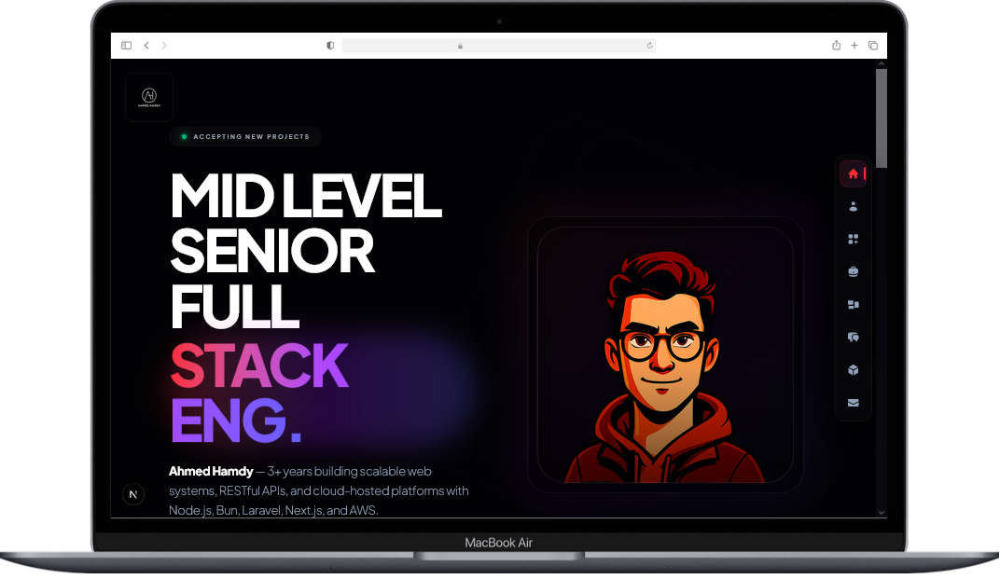

# Next.js Developer Portfolio

A responsive portfolio web application built with Next.js, React, and Tailwind CSS to showcase my projects and technical expertise.
# ✨ Developer Resume & Portfolio Engine




[](https://bun.sh)
[](https://www.typescriptlang.org/)
[](https://opensource.org/licenses/MIT)

> A fast, developer-first tool that turns simple data (Markdown/JSON) into clean, production-ready **resume + portfolio** websites.

## 🚀 What this project does
Stop rebuilding the same pages again and again.

Feed your journey—**skills**, **experience**, **projects**, and optionally **GitHub activity**—and generate a modern, SEO-friendly portfolio site quickly.

## ⚡ Tech stack

- **Runtime:** [Bun](https://bun.sh) (speed + ergonomic DX)
- **Language:** TypeScript (strict typing)
- **File discovery:** [fast-glob](https://github.com/mrmlnc/fast-glob)
- **Module resolution:** [resolve](https://github.com/browserify/resolve)

## ✨ Key features

- **Instant Preview:** fast builds using Bun.
- **Schema-driven input:** use JSON schemas or simple Markdown.
- **Zero-config defaults:** get from `init` → `deploy` quickly.

## 🏁 Getting started

### Prerequisites
- Install **Bun**: https://bun.sh

### Installation
```bash
bun install
```

### Run development mode
```bash
bun dev
```

## 🤝 Contributing
Contributions are welcome—templates, content parsing, theme improvements, and docs.

### How to contribute
1. **Find an issue**: look for Help Wanted tags.
2. **Create a branch**: `git checkout -b feature/amazing-thing`
3. **Commit**: keep commits focused and descriptive.
4. **Open a Pull Request**: reviewed within ~48 hours.

## 🗺️ Roadmap
- [x] Automated Resume-to-Data Parser (PDF/LinkedIn)
- [x] Dynamic Theme Engine (Tailwind-based)
- [x] One-click deployment to Vercel/Netlify via CLI
- [x] Review CV

## 📜 License
MIT. See `LICENSE` for details.

---

<p align="center">Built with ❤️ and ⚡ by the community</p>
